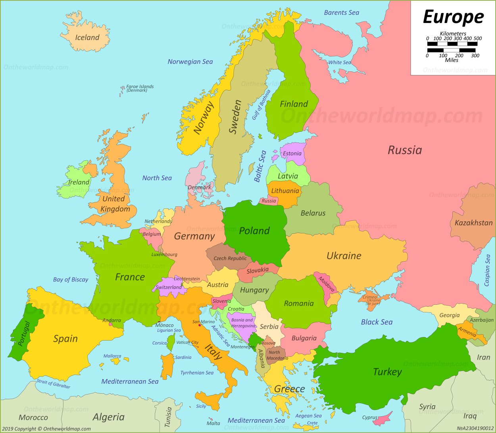

---
output:
  html_notebook:
    css: ../styles/standard_styles.css
---
```{r, echo = FALSE, message = FALSE}
library(ggplot2)
library(corrplot)
library(corrr)
library(ggcorrplot)
library(GGally)
library(visdat)
library(rattle)
library(fmsb)
library(FactoMineR)
library(factoextra)
```


### Brian Durán


<h1><center> Proyecto II </center></h1>

</br>

#### I Parte

Se le pidió a un grupo de 100 clientes que compraron el mismo producto o productos similares en la tienda de Amazon, que evaluaran el servicio recibido desde diferentes aspectos. El archivo EjemploAlgoritmosRecomendacion.csv muestra los promedios de la evaluación dada por los clientes en relación a las variables que se pueden apreciar en el encabezado de la tabla. Para este dataset, realice lo siguiente:

  a) Cargue el dataset EjemploAlgoritmosRecomendacion.csv, verifique que la lectura de los datos
  es correcta.
  
```{r, class.source="indent", class.output="indent"}
algoritmos_recomendacion <- read.csv("ejemplo_algoritmos_recomendacion.csv", sep = ";", dec = ",", header = T,row.names = 1)
algoritmos_recomendacion

```
  
  b) A manera de diagnóstico, haga una inspección de los datos presentes en el dataset y
  describa las variables presentes, tipos de variables, si hay datos nulos.
  
```{r}
vis_dat(algoritmos_recomendacion)

```
  
Como se aprecia en el gráfico anterior, en el dataset, todos los datos son de tipo númerico y no hay valores nulos dentro de la información. Además las variables presentes en el dataset son las siguientes: Velocidad de entrega, precio, durabilidad, imagen producto, valor educativo, servicio retorno, tamaño paquete, calidad producto y número de estrellas.

</br>

  c) Determine si existen correlaciones importantes entre las variables del dataset, utilizando
  alguno de los gráficos o la matriz de correlaciones vistos en clases. Recordemos que para
  aplicar un ACP, es importante que existan correlaciones entre las variables.
  
```{r}
c <- round(cor(algoritmos_recomendacion), 2)
corrplot(c)
```
  
Se puede apreciar que existe una correlación positiva fuerte entre las siguientes variables:
  
  1. Velocidad de entrega - Valor Educativo
  2. Velocidad de entrega - Calidad Producto
  3. Velocidad de entrega - Número Estrellas
  4. Imagen producto - valor educativo
  5. Valor Educativo - Número de estrellas
  6. Servicio Retorno - Imagen producto
  7. Calidad de Producto - Valor Educativo
  8. Calidad de producto - Numero de estrellas
  
También se puede ver que existe una correlación negativa fuerte entre:
  
  1. Velocidad Entrega - Tamaño Paquete
  2. Precio - Durabilidad
  
  </br>
  
  
  d) Realice un ACP usando el paquete FactoMiner, creando el plano principal y el círculo de
  correlaciones. Superponga ambos gráficos e identifique la cantidad de clústeres que considere
  apropiado. Haga un análisis descriptivo de cada clúster, indique si hay variables
  correlacionadas y el tipo de correlación entre estas.

```{r}
pca_amazon <- PCA(algoritmos_recomendacion, scale.unit=TRUE, ncp=5, graph = FALSE)
plot(pca_amazon, axes=c(1, 2), choix="ind", col.ind="red",new.plot=TRUE) 
```

```{r}
plot(pca_amazon, axes=c(1, 2), choix="var", col.var="blue",new.plot=TRUE)
```


```{r}
fviz_pca_biplot(pca_amazon, repel = FALSE,
                col.var = "#2E9FDF", # Variables color
                col.ind = "#696969"  # Individuals color
                )
```

Al realizar el círculo de correlaciones se aprecian los mismo resultados que se obtuvieron en la sección **C**.


```{r}
pca_amazon.hcpc <- HCPC(pca_amazon, nb.clust=-1, min=2, max=3)
```

Se puede ver que a grades rasgos existen 2 clústeres (Es lo que la función anterior sugiere). El clúster 1 parece tender a la variable "Tamaño Paquete" mientras que el clúster 2 a "Durabilidad". Nótese que se pueden especificar más clústeres si se deseara. E.g. 3 clústeres.

```{r}
pca_amazon.hcpc <- HCPC(pca_amazon, nb.clust=3, min=2, max=3)
```


<br>  
  
  e) Repita el ejercicio anterior usando el paquete FactoMineR, elimine de los gráficos los
  individuos con $cos^{2}(\theta) \le 0.2$ y las variables $cos^{2}(\theta) \le 0.55$. y vuelva
  a crear el plano principal y el círculo de correlaciones. ¿Cuáles individuos quedaron mal
  representados?, ¿cuáles variables quedaron mal representadas?

```{r}

cos2_ind <- (pca_amazon$ind$cos2[,1] + pca_amazon$ind$cos2[,2])
cos2_ind

malrep <- NULL
# Seguidamente se seleccionan las entradas que cumplen la restricción, es decir, lo mal representados
for (i in 1 : nrow(algoritmos_recomendacion)) {
 header <- names(cos2_ind)[i]
 ifelse(cos2_ind[i] <= 0.2, malrep <- cbind(matrix(c(header, cos2_ind[i]), 2, 1, TRUE), malrep), NA)
}
malrep

```

Se puede ver que Sebastian, Isabelle y Henry están mal representados en este set de datos.


```{r}

cos2_var <- (pca_amazon$var$cos2[,1] + pca_amazon$var$cos2[,2])
cos2_var

var_malrep <- NULL #crea un vector
# Seguidamente se seleccionan las entradas que cumplen la restricción, es decir, lo mal representados
for (i in 1 : nrow(algoritmos_recomendacion)) {
 header <- names(cos2_var)[i]
 ifelse(cos2_var [i] <= 0.55, var_malrep <- cbind(matrix(c(header, cos2_var[i]), 2, 1, TRUE), var_malrep), NA)
}
var_malrep

```

Según el resultado, solo la variable "Servicio Retorno" no cumple con los requisitos mínimos.

</br>

  f) Realice un gráfico radar (araña) usando 3 clústeres e interprete cada uno de los
  clústeres.

```{r}
modelo <- hclust(dist(algoritmos_recomendacion),method= "ward.D")
#modelo

centros<-centers.hclust(algoritmos_recomendacion,modelo,nclust=3,use.median=FALSE)
#centros

rownames(centros)<-c("Cluster 1","Cluster 2","Cluster 3")
centros<-as.data.frame(centros)
centros2<-as.data.frame(centros)

maximos<-apply(centros,2,max)
minimos<-apply(centros,2,min)
centros<-rbind(minimos,centros)
centros<-rbind(maximos,centros)
centros
```

```{r}
radarchart(centros,maxmin=TRUE,axistype=4,axislabcol="slategray4",
           centerzero=FALSE,seg=8,cglcol="gray67",
           pcol=c("blue","red","green"),
           plty=1,
           plwd=5,
           title="Comparación de clústeres")

legenda <-legend(1.5,1, legend=c("Cluster 1","Cluster 2","Cluster 3"),
                 seg.len=-1.4,
                 title="Clústeres",
                 pch=21, 
                 bty="n" ,lwd=3, y.intersp=1, horiz=FALSE,
                 col=c("blue","red","green"))
```

Se puede que los individuos del **clúster 1** calificaron más alto el **Precio** y **Tamaño de Paquete**, los miembros del **clúster 2** concordaron que el servicio fue mejor con respecto al **precio, número de estrellas, calidad del producto, tamaño del paquete, servicio de retorno, valor educativo e imagen del producto**. Por último lo miembros del **clúster 3** percibieron el servicio recibido como positivo en los aspectos de **durabilidad, Velocidad de entrega, número de estrellas, calidad del producto y valor educativo**.


  g) Suponga que se trabajaron los datos con 3 clústeres, como se muestra en el plano principal
  siguiente:

  <center>  </center>


<div class="text-indent">Partiendo del hecho de que todos los individuos compraron, ya sea el mismo producto o similares, pero, cada uno tuvo una experiencia de compra diferente que pudo ser mejor o peor en los diferentes rubros de la evaluación.

  <ul>
  <li>¿Qué productos recomendaría a Salome</li>
  <li>¿Qué productos recomendaría a Stephania?</li>
  <li>¿Qué productos recomendaría a Lydia?</li>
  </ul>

  Es decir, los mismos productos que compró cuál otro cliente.
</div>


```{r}
fviz_pca_biplot(pca_amazon, repel = FALSE,
                col.var = "#2E9FDF", # Variables color
                col.ind = "#696969"  # Individuals color
                )
```

Tomando en cuenta el gráfico anterior, en el cual se superpusieron el plano principal y el círculo de correlaciones, a **Salome** se le pueden recomendar productos con una puntuación alta en **Imagen Producto** y **Precio**, a **Stephania** productos con un alto **Valor Educativo** y a **Lydia** no podríamos saber que recomendarle puesto que esta muy alejada de cualquier variable.


</br>


#### II Parte

Considérese tabla datos ConsumoEuropa.csv que contiene una estimación del consumo promedio de
proteínas, en gramos, por persona y por día, en Europa, datos del año 1981 (Está en el aula
virtual con el nombre).


  a) Usando FactoMineR efectúe un ACP para esta tabla de datos
```{r}
consumo_europa <- read.csv("consumo_europa.csv", sep = ";", dec = ",", header = T,row.names = 1)
pca_europa<- PCA(consumo_europa, scale.unit=TRUE, ncp=5, graph = FALSE)
pca_europa$var
```


  
  b) Grafique el plano principal y el círculo de correlaciones, luego compare este Plano
  Principal con el mapa de Europa ¿Qué conclusiones puede sacar?
  
```{r}
plot(pca_europa, axes=c(1, 2), choix="ind", col.ind="red",new.plot=TRUE)
```

```{r}
plot(pca_europa, axes=c(1, 2), choix="var", col.var="blue",new.plot=TRUE) 
```
  
Considere que podría recortar alguno de estos gráficos, hacer rotaciones y si es necesario buscar
un mapa de Europa, de preferencia un mapa político.

<center>  </center>

</br>

Según el plano principal, el círculo de correlaciones y el mapa de europa, se puede apreciar que la mayoría de europa obtiene su fuente de proteínas de carne animal, huevos, carne de cerdo, leche y cereales. Pero España y Portugal tienen al pescado y las frutas como fuente principal.


<!-- ----------------------------------------------------------- -->
<!--
Esta sección es solo para agregar estilos y elementos 
personalizados al html generado por rStudio  
-->
<!-- ----------------------------------------------------------- -->

&nbsp;

<hr />
<p style="text-align: center;">Autor <a href="https://github.com/bdurans">Brian Duran</a></p>
<p style="text-align: center;"><span style="color: #808080;"><em>bduran0393@gmail.com</em></span></p>

<!-- Add icon library -->
<link rel="stylesheet" href="https://cdnjs.cloudflare.com/ajax/libs/font-awesome/4.7.0/css/font-awesome.min.css">

<!-- Add font awesome icons -->
<p style="text-align: center;">
    <a href="https://github.com/bdurans/tec_data_science_course/tree/master/mathematics_for_data_science/second_project" class="fa fa-github"></a>
</p>

<a href="https://github.com/bdurans/tec_data_science_course/tree/master/mathematics_for_data_science/second_project" class="github-corner" aria-label="View source on GitHub"><svg width="80" height="80" viewBox="0 0 250 250" style="fill:#151513; color:#fff; position: absolute; top: 0; border: 0; right: 0;" aria-hidden="true"><path d="M0,0 L115,115 L130,115 L142,142 L250,250 L250,0 Z"></path><path d="M128.3,109.0 C113.8,99.7 119.0,89.6 119.0,89.6 C122.0,82.7 120.5,78.6 120.5,78.6 C119.2,72.0 123.4,76.3 123.4,76.3 C127.3,80.9 125.5,87.3 125.5,87.3 C122.9,97.6 130.6,101.9 134.4,103.2" fill="currentColor" style="transform-origin: 130px 106px;" class="octo-arm"></path><path d="M115.0,115.0 C114.9,115.1 118.7,116.5 119.8,115.4 L133.7,101.6 C136.9,99.2 139.9,98.4 142.2,98.6 C133.8,88.0 127.5,74.4 143.8,58.0 C148.5,53.4 154.0,51.2 159.7,51.0 C160.3,49.4 163.2,43.6 171.4,40.1 C171.4,40.1 176.1,42.5 178.8,56.2 C183.1,58.6 187.2,61.8 190.9,65.4 C194.5,69.0 197.7,73.2 200.1,77.6 C213.8,80.2 216.3,84.9 216.3,84.9 C212.7,93.1 206.9,96.0 205.4,96.6 C205.1,102.4 203.0,107.8 198.3,112.5 C181.9,128.9 168.3,122.5 157.7,114.1 C157.9,116.9 156.7,120.9 152.7,124.9 L141.0,136.5 C139.8,137.7 141.6,141.9 141.8,141.8 Z" fill="currentColor" class="octo-body"></path></svg></a><style>.github-corner:hover .octo-arm{animation:octocat-wave 560ms ease-in-out}@keyframes octocat-wave{0%,100%{transform:rotate(0)}20%,60%{transform:rotate(-25deg)}40%,80%{transform:rotate(10deg)}}@media (max-width:500px){.github-corner:hover .octo-arm{animation:none}.github-corner .octo-arm{animation:octocat-wave 560ms ease-in-out}}</style>

<script>
$(document).ready(function () {
    $('pre.r').addClass('indent');
});
</script>

&nbsp;